<div align="center">

<h1>🎧 StreamWave</h1>

**YouTube 음악 스트리밍과 라이브 방송을 한곳에서. 방송을 보며 신청곡에 투표하고, 음표로 응원하고, 듣던 곡의 음반까지 바로 사는 음악 플랫폼**


<br />

<a href="https://github.com/cjsrudgh98-crypto/-MUSIC-main2/raw/main/docs/portfolio/StreamWave-portfolio.pdf"></a>
<a href="docs/demo/StreamWave-demo.mp4"></a>

</div>

<p align="center">
  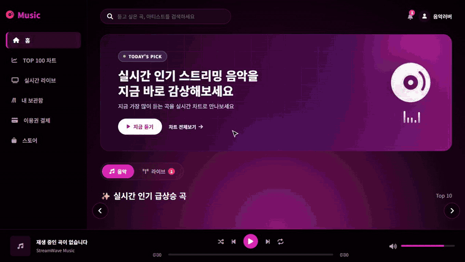
  <br />
  <sub>▲ 실제 서비스 화면 시연 (2배속) · 원본 영상: <a href="docs/demo/StreamWave-demo.mp4">StreamWave-demo.mp4</a></sub>
</p>

---

## 목차

- [시연 영상 · 포트폴리오](#-시연-영상--포트폴리오)
- [프로젝트 소개](#-프로젝트-소개)
- [주요 기능](#-주요-기능)
- [화면](#-화면)
- [기술 스택](#-기술-스택)
- [아키텍처](#-아키텍처)
- [기술적으로 고민한 부분](#-기술적으로-고민한-부분)
- [테스트](#-테스트)
- [실행 방법](#-실행-방법)
- [프로젝트 구조](#-프로젝트-구조)
- [개발자](#-개발자)

---

## 🎬 시연 영상 · 포트폴리오

| | |
|---|---|
| ▶ **시연 영상** | [StreamWave-demo.mp4](docs/demo/StreamWave-demo.mp4) (2분 17초, 1280×720). 자막으로 단계를 안내하므로 소리 없이 볼 수 있습니다. |
| 📄 **포트폴리오 PDF** | [StreamWave-portfolio.pdf](https://github.com/cjsrudgh98-crypto/-MUSIC-main2/raw/main/docs/portfolio/StreamWave-portfolio.pdf) (A4 8쪽): 개요 · 화면 · 시스템 구조 · 기술적 도전과 해결 8가지 · 테스트 |

**영상 순서**

1. 실시간 인기 급상승 곡 · 장르별 최신곡
2. 띄어쓰기와 상관없는 곡·아티스트 검색 → 바로 재생
3. 지금 듣는 곡의 음반·굿즈를 플레이어 바에서 바로
4. 수량·배송지 입력 → 토스페이먼츠 결제창
5. 실시간 TOP 100 (최근 24시간 청취 → 누적 청취 순)
6. 라이브 방송 입장 (HLS 재생)
7. 신청곡 투표 (버튼 / 채팅 "투표1", 1인 1표)
8. 실시간 채팅 (다른 시청자·방송자와 대화)
9. ♪ 음표로 방송자 응원 → 결제창
10. 좋아요 · 최근 들은 곡 · 플레이리스트 전체 재생
11. 관리자: 스토어 관리 (상품 · 곡 연결)
12. 모바일 전용 화면: 하단 탭바 → 라이브 시청 → 곡 재생 → 전체화면 플레이어

<details>
<summary>영상과 PDF는 코드로 다시 만들 수 있습니다</summary>

- 영상: [`record-demo.mjs`](docs/demo/record-demo.mjs)가 실제 서버를 브라우저(Edge)로 조작하며 화면을 녹화합니다(Playwright + CDP screencast). 방송자·다른 시청자 창을 따로 띄워 채팅과 투표를 실제로 주고받습니다. [`make-video.mjs`](docs/demo/make-video.mjs)가 ffmpeg로 MP4와 GIF를 만듭니다.
- 라이브 영상: OBS·SRS 없이 [`live-test-stream.mjs`](docs/demo/live-test-stream.mjs)가 ffmpeg로 테스트 방송(제목·시계·음파)을 HLS로 만들어 SRS와 같은 주소(`:8081/live/{재생ID}.m3u8`)로 서빙합니다.
- 데이터: [`seed-demo.py`](docs/demo/seed-demo.py)가 **데모 전용 스키마**로 띄운 서버에 예시 계정·상품·방송·플레이리스트를 넣습니다. 곡 카탈로그는 실제 데이터를 복사해 씁니다.
- PDF: [`portfolio.html`](docs/portfolio/portfolio.html)을 [`build-pdf.mjs`](docs/portfolio/build-pdf.mjs)가 A4로 인쇄합니다.

```bash
cd docs && npm install            # playwright-core · ffmpeg-static (브라우저는 설치된 Edge/Chrome 사용)
python demo/seed-demo.py          # 데모 전용 스키마로 띄운 백엔드(8080)·프론트(3000) 대상
npm run live                      # 테스트 방송 (다른 터미널에 띄워 둠)
npm run demo && npm run video     # 녹화 → docs/demo/StreamWave-demo.mp4 / .gif
npm run pdf                       # docs/portfolio/StreamWave-portfolio.pdf
```

</details>

---

## 📌 프로젝트 소개

음악은 혼자 듣기도 하지만, 누군가의 방송에서 함께 듣기도 합니다. 그런데 두 경험은 보통 서로 다른 서비스에 흩어져 있습니다.

**StreamWave**는 이 둘을 하나로 묶었습니다.

1. **듣기**: YouTube 음원 카탈로그를 차트·장르·검색으로 탐색하고, 플레이리스트와 최근 들은 곡으로 내 취향을 쌓습니다.
2. **함께 듣기**: OBS로 송출하는 라이브 방송에서 시청자가 **신청곡에 투표**하면, 1위 곡이 방송자의 플레이어에 바로 예약됩니다.
3. **응원하고 소장하기**: 방송자에게 **음표(♪)** 로 후원하고, 지금 듣는 곡의 **음반·굿즈를 스토어에서 바로 구매**합니다.

등급별 이용권(라이트 · 스탠다드 · 프리미엄) 결제, 스토어 주문·환불, 채팅 관리, 관리자 기능까지 실제 운영을 전제로 만들었습니다.

> 기획부터 백엔드 · 프론트엔드 · 배포까지 **혼자 진행한 개인 프로젝트**입니다.

---

## ✨ 주요 기능

### 🎵 음악 스트리밍
| 기능 | 설명 |
|---|---|
| **YouTube 카탈로그** | 플레이리스트·채널·지역별 인기 차트를 동기화합니다. 쇼츠·인터뷰·라이브 클립 같은 비음악 영상은 길이·키워드·채널 규칙으로 걸러냅니다. |
| **같은 곡 중복 정리** | 레이블·업로더만 다른 같은 곡을 정규화한 제목과 **재생시간(±5초)** 으로 묶어 대표 1곡만 보여 줍니다. |
| **실시간 TOP 100** | 최근 24시간 동안 들은 곡이 먼저 오고, 남는 자리는 이 서비스의 **누적 청취 순**, 그다음 YouTube 조회수 순으로 채웁니다. 차트에는 전곡 재생(30초 이상)만 반영됩니다. |
| **검색** | 띄어쓰기와 상관없이 제목·아티스트를 찾습니다. 입력하는 동안에는 DB에서만 찾고, 검색어가 1.5초 그대로일 때만 YouTube에서 새 곡을 보강합니다. |
| **플레이어** | 곡 목록 단위 재생 큐, 셔플·반복, 새로고침해도 이어지는 재생 위치, 백그라운드 탭 자동 넘김. |
| **내 보관함** | 좋아요 · 최근 들은 곡(30초 이상 청취, 최근 50곡) · **직접 만드는 플레이리스트** |
| **이용권** | 토스페이먼츠 결제. 등급마다 쓸 수 있는 기능이 다르고, **서버가 기능별로 허용 여부를 판정**합니다 (관리자 · 부관리자는 전부). 같은 등급을 다시 사면 만료일 뒤로 기간이 이어 붙고(예약), 다른 등급은 바로 적용돼 기능이 합쳐집니다. |

#### 💳 이용권 등급

| 이용권 | 가격 | 전곡 재생 | 플레이리스트 | 채팅 프리미엄 ♪ 배지 | 스토어 할인 |
|---|---|---|---|---|---|
| 무료 | 0원 | 하루 1분 미리듣기 | – | – | – |
| 라이트 30곡 | 4,900원 / 월 | 30곡 (같은 곡 재생은 차감 없음) | – | – | – |
| 스탠다드 | 7,900원 / 월 | 무제한 | ✓ | – | – |
| 프리미엄 | 10,900원 / 월 | 무제한 | ✓ | ✓ | 10% |
| 프리미엄 연간 | 109,000원 / 12개월 | 무제한 | ✓ | ✓ | 10% |

- 좋아요 · 라이브 시청 · 채팅 · 신청곡 투표 · 음표 후원은 무료 회원도 쓸 수 있습니다.
- 라이트는 곡을 **30초 이상 들은 시점에 1곡 차감**합니다. 30곡을 다 쓰면 새 곡은 미리듣기로 바뀌고, 이미 들은 곡은 기간 동안 계속 전곡 재생됩니다.
- 플레이리스트는 이용권이 끝나도 보기 · 재생 · 정리는 할 수 있고, 만들기 · 곡 담기만 막힙니다.
- 채팅 ♪ 배지와 스토어 할인가는 서버가 이용권을 확인해 붙이므로 클라이언트가 위조할 수 없습니다.

### 📡 라이브 방송
| 기능 | 설명 |
|---|---|
| **OBS 송출** | SRS 미디어 서버로 RTMP를 받아 HLS로 재생합니다. 2분마다 방송 화면을 캡처해 목록 썸네일로 씁니다. |
| **실시간 채팅** | STOMP over SockJS. 발신자는 서버가 로그인 정보로 정하므로 닉네임 사칭이 불가능합니다. 프리미엄 회원의 메시지에는 `♪ PREMIUM` 배지가 붙습니다. |
| **신청곡 투표** | 방송자가 카탈로그에서 곡을 골라 투표를 열면, 시청자는 버튼이나 채팅 `투표1`로 1인 1표. **1위 곡 다음 재생**을 누르면 방송자의 플레이어에 그 곡이 예약됩니다. |
| **채팅 관리** | 방송자가 메시지를 삭제하고 시청자를 10분 / 방송 동안 채팅 금지할 수 있습니다. 연결당 도배 제한도 있습니다. |
| **OBS 오버레이 · 채팅 독** | 투명 배경 채팅 오버레이(방송 화면용)와 입력 가능한 채팅 독(OBS 커스텀 독용)을 제공합니다. |
| **미니 플레이어 · 알림** | 다른 페이지로 가도 방송이 작은 창으로 이어지고, 팔로우한 채널이 방송을 켜면 알림이 옵니다. |

### ♪ 음표 (라이브 후원)
| 기능 | 설명 |
|---|---|
| **음표 보내기** | 1음표 = 1원. 1,000 ~ 500,000개를 메시지와 함께 보냅니다. |
| **음표 알림** | 결제가 승인되면 채팅창과 OBS 오버레이에 음표 모양 알림이 뜹니다. 이 알림은 서버만 보낼 수 있습니다. |
| **받은 음표** | 방송자는 스튜디오에서 받은 음표 목록과 누적 개수를 확인합니다. |

### 🛍 스토어
| 기능 | 설명 |
|---|---|
| **관련 상품** | 재생 중인 곡과 연결된 상품, 같은 아티스트의 상품을 플레이어 바에서 바로 보여 줍니다. |
| **주문 · 결제** | 배송지 입력 → 토스 결제. 금액(프리미엄 10% 할인 포함)은 서버가 계산하고, 재고는 결제 승인 직전에 원자적으로 차감합니다. |
| **취소 · 환불** | 구매자는 배송 전까지, 관리자는 배송 중까지 취소할 수 있으며 결제 취소와 재고 복구가 함께 처리됩니다. |
| **스토어 관리** | 관리자가 상품 등록·수정·판매 중지, 곡 연결, 주문 상태(배송 시작 → 배송 완료) 관리를 합니다. |

### 🔐 회원 · 관리자
- 이메일 회원가입 + **소셜 로그인**(Kakao, Naver, Google OAuth2)
- 이메일 인증번호로 아이디 찾기·비밀번호 재설정 (5분 만료, 5회 실패 시 폐기)
- 로그인·인증번호 요청 **Rate Limit**
- 권한 3단계: 일반 회원 / 부 관리자(콘텐츠·스토어) / 최고 관리자(권한 부여)
- **모바일 전용 화면**: 768px 이하에서는 데스크톱을 줄인 화면이 아니라 하단 탭바 · 미니 플레이어 · 전체화면 플레이어로 된 별도 화면

---

## 📱 화면

<table>
  <tr>
    <td align="center"><b>라이브 방송 · 신청곡 투표 · 채팅</b></td>
    <td align="center"><b>음표 보내기</b></td>
    <td align="center"><b>TOP 100 차트</b></td>
  </tr>
  <tr>
    <td>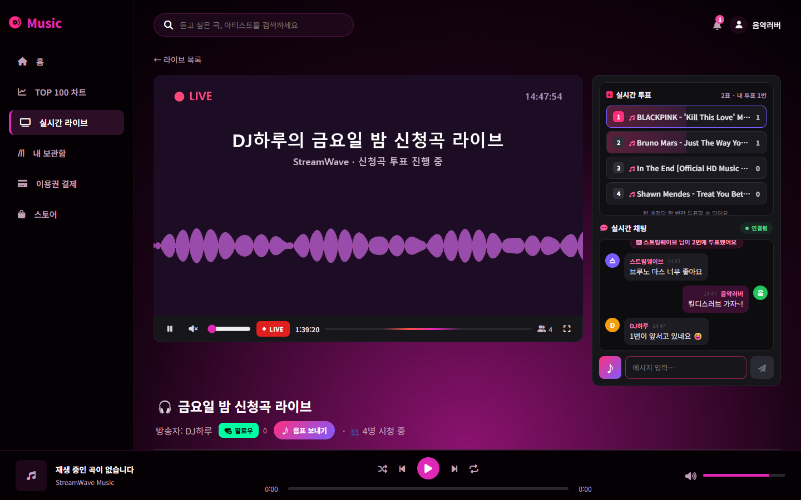</td>
    <td>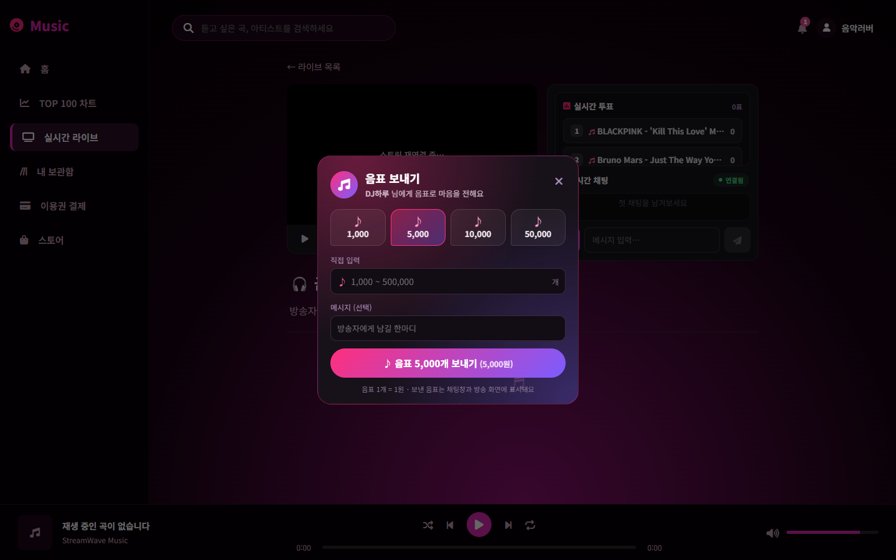</td>
    <td>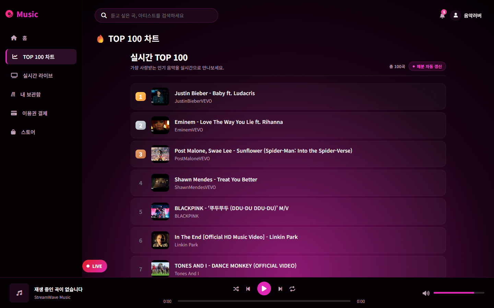</td>
  </tr>
  <tr>
    <td align="center"><b>스토어</b></td>
    <td align="center"><b>상품 상세 · 주문</b></td>
    <td align="center"><b>지금 듣는 곡의 관련 상품</b></td>
  </tr>
  <tr>
    <td>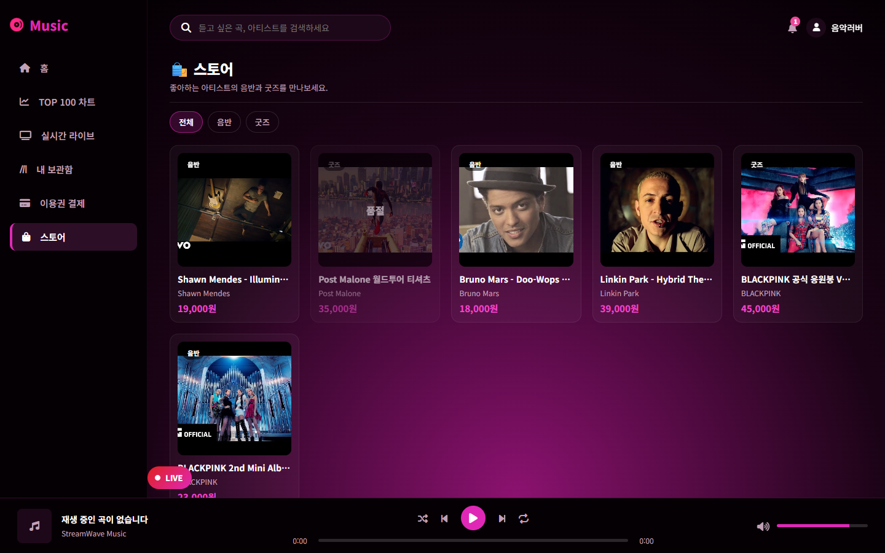</td>
    <td>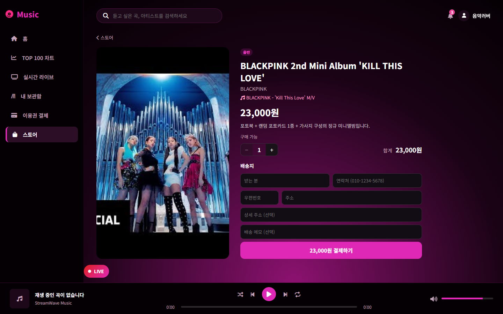</td>
    <td>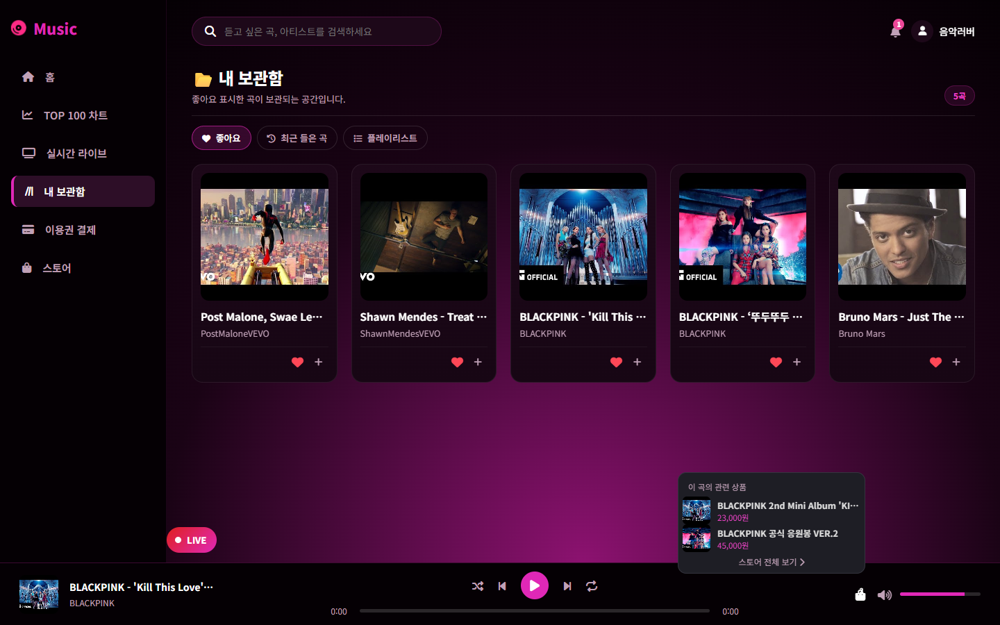</td>
  </tr>
  <tr>
    <td align="center"><b>내 플레이리스트</b></td>
    <td align="center"><b>관리자 · 스토어 관리</b></td>
    <td align="center"><b>OBS 채팅 독 (방송자용)</b></td>
  </tr>
  <tr>
    <td>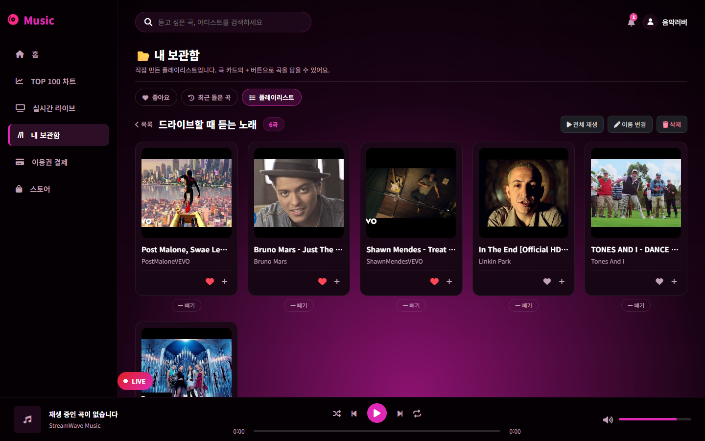</td>
    <td>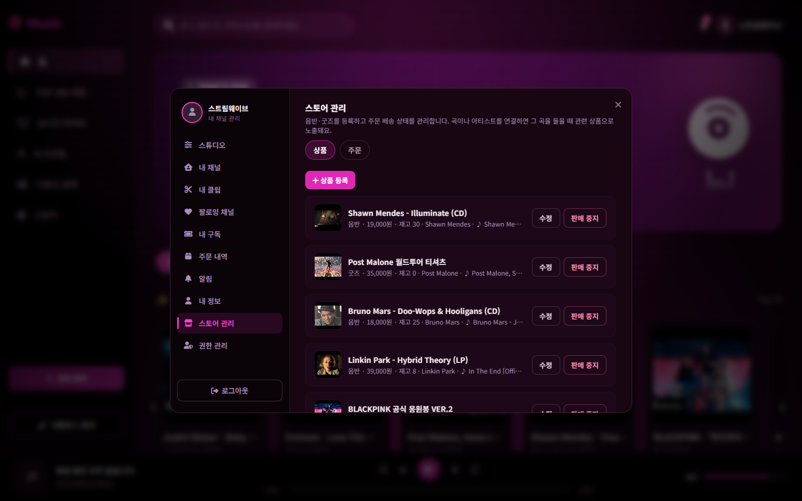</td>
    <td align="center">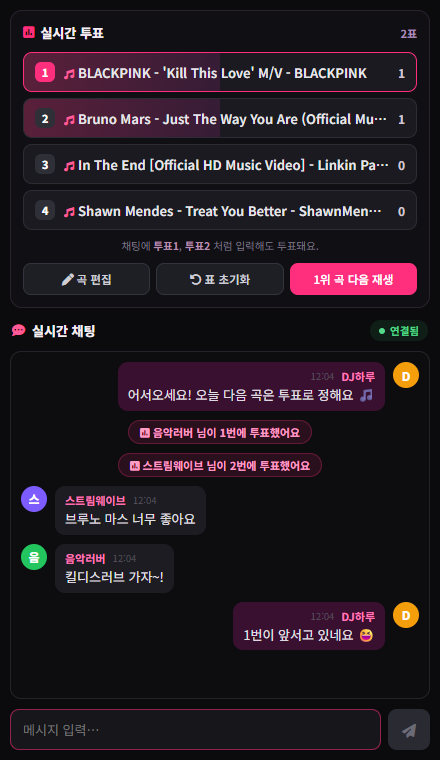</td>
  </tr>
  <tr>
    <td align="center"><b>모바일 홈</b></td>
    <td align="center"><b>모바일 전체화면 플레이어</b></td>
    <td align="center"><b>모바일 라이브 시청</b></td>
  </tr>
  <tr>
    <td align="center">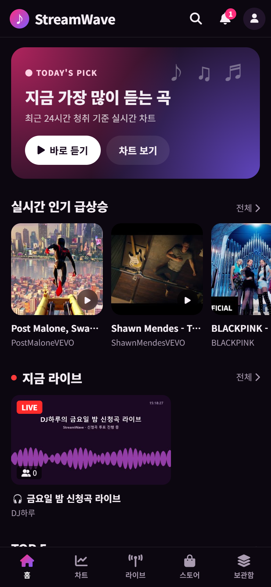</td>
    <td align="center">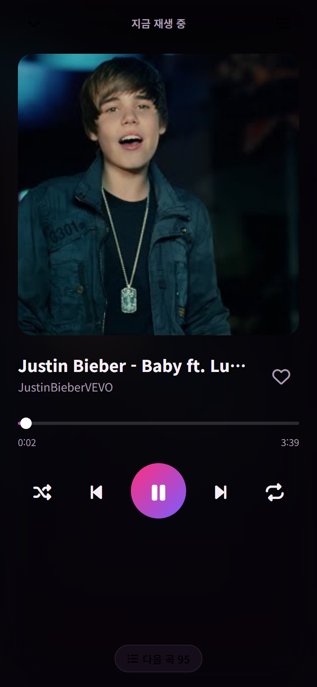</td>
    <td align="center">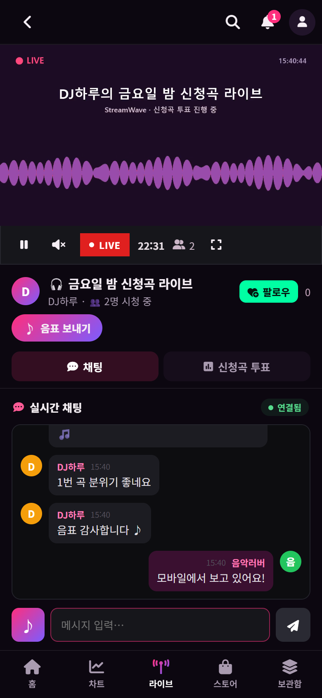</td>
  </tr>
</table>

> 모바일(768px 이하)은 데스크톱을 줄인 화면이 아니라 별도로 설계한 화면입니다: 상단 앱 바 · 하단 탭바(홈/차트/라이브/스토어/보관함) · 미니 플레이어 → 전체화면 플레이어 · 곡 ⋯ 시트 · 라이브는 영상 아래 [채팅 | 신청곡 투표] 탭.

> 실제 서버를 로컬에서 띄워 브라우저로 촬영했습니다. 곡 카탈로그는 실제 데이터이고, 상품·방송·채팅·플레이리스트는 촬영용 예시 데이터입니다. 라이브 영상은 ffmpeg 테스트 방송입니다.

---

## 🧰 기술 스택

| 영역 | 기술 |
|---|---|
| **Backend** | Java 25, Spring Boot 4.1 (Web, Data JPA, Security, OAuth2 Client, WebSocket/STOMP, Mail, Validation), springdoc-openapi |
| **Auth** | Bearer 불투명 토큰(Redis, 7일) + 세션, OAuth2 (Kakao / Naver / Google) |
| **Data** | MySQL 8, Redis (토큰 · 차트 · 투표 · 시청자 수 · 알림 · 채팅 금지) |
| **Live** | SRS 6 (RTMP 수신 → HLS), HTTP 훅으로 송출 검증, ffmpeg 썸네일 캡처, OBS |
| **외부 연동** | YouTube Data API v3 (다중 키 로테이션), 토스페이먼츠 결제위젯·승인·취소, AWS S3 + CloudFront, Gmail SMTP |
| **Frontend** | React 18, Vite 5, React Router 6, Axios, @stomp/stompjs + SockJS, hls.js, react-youtube |
| **Test** | JUnit 5, Spring Boot Test, Mockito (`@MockitoBean`) |
| **Infra** | Docker Compose (MySQL · Redis · SRS · Spring · Caddy), Caddy 자동 HTTPS 리버스 프록시 |

---

## 🏗 아키텍처

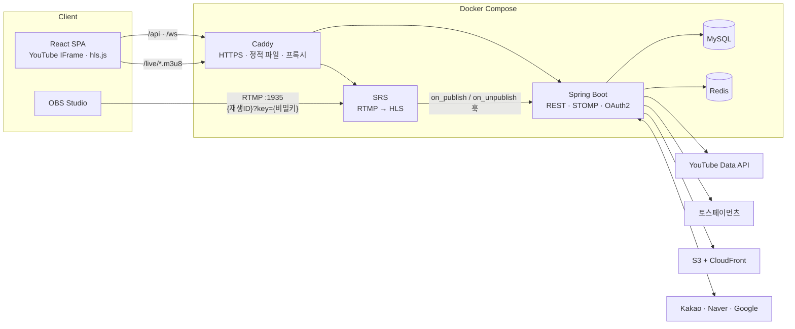

- 프론트 빌드 결과는 Caddy 이미지에 들어가고, `/api`·`/ws`는 Spring으로, HLS 파일만 SRS로 보냅니다. SRS 웹훅 경로(`/api/broadcast/srs/*`)는 외부에서 막혀 있습니다.
- 라이브 송출 흐름:

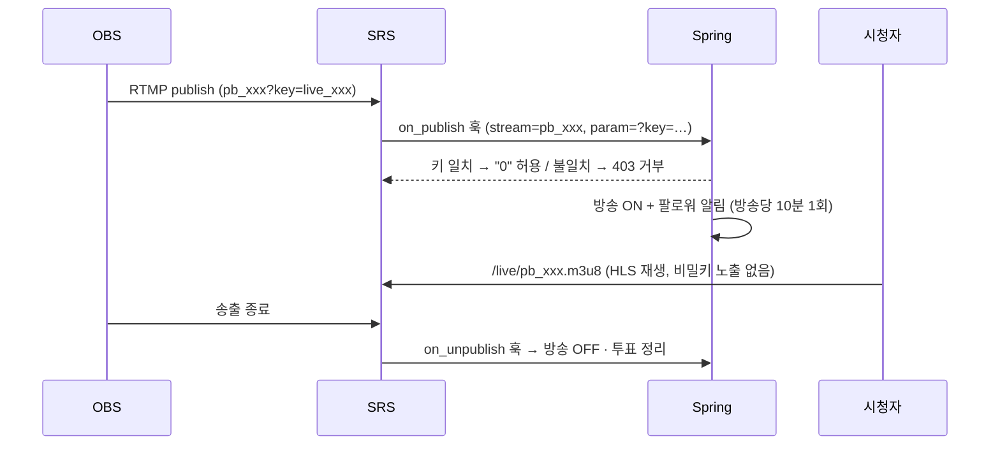

- 스토어 주문 상태:

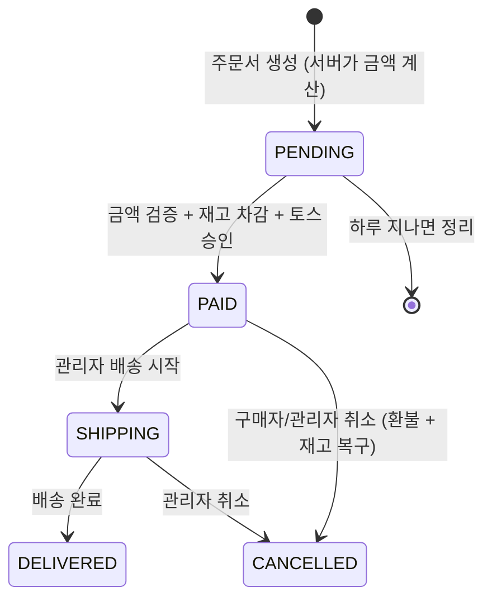

---

## 💡 기술적으로 고민한 부분

<details>
<summary><b>1. 라이브 방송 가로채기 방지: 재생 ID와 송출 키 분리</b></summary>

- 처음에는 스트림 키가 곧 HLS 파일 이름이라, 시청자가 주소창에서 키를 보고 같은 키로 송출해 **방송을 가로챌 수 있었습니다.**
- 공개용 `playbackId`와 비밀 `streamKey`를 나눴습니다. OBS에는 `{playbackId}?key={streamKey}`를 넣고, SRS가 넘겨주는 `param`의 키를 `on_publish` 훅에서 **상수 시간 비교**로 검증해 틀리면 송출을 거부합니다.
- 웹훅 경로는 Caddy에서 외부 접근을 막아, 남의 방송을 강제로 OFF 처리할 수도 없게 했습니다.
</details>

<details>
<summary><b>2. 결제 금액 위변조와 재고 정합성 (이용권 · 음표 · 스토어)</b></summary>

- 결제창을 열기 전에 서버가 금액을 고정한 **PENDING 주문**을 만들고, 승인 요청의 금액이 이와 다르면 토스를 호출하지 않고 거절합니다. 같은 주문의 중복 승인(새로고침)은 한 번만 처리합니다.
- 스토어는 `UPDATE … SET stock = stock - :qty WHERE stock >= :qty`로 **재고를 원자적으로 차감한 뒤** 토스 승인을 호출합니다. 승인이 실패하면 트랜잭션이 롤백되어 재고도 돌아옵니다. 동시에 결제해도 재고보다 많이 팔리지 않습니다.
- 환불은 토스 결제 취소가 성공한 경우에만 재고 복구와 상태 변경을 합니다. 결제창에서 그만둔 PENDING 주문은 스케줄러가 하루 뒤 정리합니다.
</details>

<details>
<summary><b>3. 실시간 채팅의 신원과 1인 1표</b></summary>

- 클라이언트가 보낸 `sender` 이름을 믿으면 방송자 닉네임으로 투표창 명령을 보내거나, 이름을 바꿔 가며 무제한 투표할 수 있었습니다.
- 웹소켓 핸드셰이크에서 인증된 **STOMP `Principal`** 로 발신자를 서버가 정하고, 투표는 사용자 PK 기준 Redis `SETNX`로 **원자적 1인 1표**를 보장합니다. 채팅 `투표1`과 버튼 투표가 같은 표로 합산됩니다.
- 음표 알림·삭제 신호 같은 시스템 메시지 타입은 클라이언트가 보낼 수 없고, 연결당 5초 5개의 도배 제한과 방송자 채팅 금지(Redis TTL)를 둡니다.
</details>

<details>
<summary><b>4. YouTube API 할당량 (하루 10,000유닛)</b></summary>

- `search.list`는 호출당 100유닛이라 하루 약 100번이면 끝납니다. 동기화는 1유닛짜리 `playlistItems`·`videos.list` 위주로 바꾸고, 대량 키워드 검색은 격일 새벽에만 돌립니다.
- 키를 여러 개 두고, **할당량 사유의 403/429일 때만** 그 키를 태평양 자정까지 봉인하고 다음 키로 넘어갑니다. (키 설정 오류 같은 403까지 봉인하면 멀쩡한 키가 하루 동안 막힙니다.)
- 검색 결과가 부족할 때 YouTube에서 보강하는 기능은 **로그인 사용자만**, 사이트 전체 **시간당 10회 · 하루 40회** 상한 안에서 동작합니다. 비로그인 사용자가 검색어를 바꿔 가며 할당량을 소진하는 것을 막기 위해서입니다.
- 입력하는 대로 검색하는 화면에서 "르세", "르세라", "르세라핌"처럼 **중간 글자마다 YouTube 검색이 나가 한도를 몇 회씩 쓰는 문제**가 있었습니다. `youtube=false`(DB만) 옵션을 만들어 입력 중에는 DB만 찾고, 검색어가 1.5초 그대로일 때만 보강하도록 바꿨습니다. 실측으로 단어 하나당 보강 1회를 확인했습니다.
</details>

<details>
<summary><b>5. "실시간" 차트를 진짜 실시간으로</b></summary>

- 기존 Redis ZSET은 점수가 줄지 않는 누적값이라, 한번 올라간 곡이 계속 상위에 남았습니다.
- 청취 점수를 **시간대별 버킷**(`chart:h:{epochHour}`)에 쌓고, 조회할 때 최근 24개 버킷을 합산합니다. 결과는 30초 캐시합니다. 오래된 버킷은 조회 시 정리합니다.
- 같은 사용자가 같은 곡을 반복 재생해도 **한 시간에 1점**만 반영해 차트 조작을 막았습니다.
- 그런데 청취가 뜸한 날에는 24시간 창이 비어 **차트 전체가 YouTube 조회수 순으로 바뀌어**, 이 서비스에서 실제로 많이 들은 곡이 사라졌습니다. 남는 자리를 DB 누적 청취 순으로 먼저 채우고 조회수는 마지막에 쓰도록 단계를 나눴습니다.
</details>

<details>
<summary><b>6. 소셜 로그인 계정 연결과 계정 탈취</b></summary>

- 이메일로 계정을 찾아 연결하는데, 카카오는 **미인증 이메일**을 줄 수 있어 남의 이메일을 넣은 카카오 계정으로 그 사람 계정에 들어갈 수 있었습니다.
- 제공자가 인증한 이메일(`is_email_verified`, `email_verified`)만 받고, 같은 이메일의 일반 계정에 처음 연결될 때는 기존 비밀번호를 무효화합니다. 이메일 인증 없이 **남이 먼저 내 이메일로 가입해 둔 계정**을 공격자가 계속 쓰지 못하게 하기 위해서입니다.
- 로그인 직후 토큰은 쿼리(`?`)가 아닌 프래그먼트(`#`)로 넘겨 서버 로그·Referer에 남지 않게 했습니다.
</details>

<details>
<summary><b>7. 곡 삭제와 외래키: 목록 조회가 통째로 실패하던 문제</b></summary>

- 비음악 영상은 목록을 조회하면서 정리(삭제)하는데, 좋아요·청취기록이 걸린 곡을 지우면 **커밋 시점에 FK 오류**가 나서 홈 화면 곡 목록 요청 전체가 500이 됐습니다. (실제 재현 테스트로 확인)
- 모든 삭제 경로를 `MusicRemover`로 통일해 참조 기록을 먼저 지우고, 새로 만든 테이블(플레이리스트·상품)은 `ON DELETE CASCADE / SET NULL`로 설계했습니다. 회귀 테스트로 고정했습니다.
</details>

<details>
<summary><b>8. 운영 보안 기본기</b></summary>

- 비밀값은 저장소에서 빼고 로컬은 `application-secret.properties`(git 제외), 운영은 `.env` 환경변수로 주입합니다. Docker 이미지에도 들어가지 않게 `.dockerignore`를 뒀습니다.
- 500 응답에는 SQL·테이블 이름 대신 **오류 ID**만 내보내고, 원인은 같은 ID로 서버 로그에서 찾습니다.
- 웹소켓 접속 출처를 서비스 도메인으로 제한하고, 운영에서는 Swagger를 끕니다.
</details>

<details>
<summary><b>9. 라이브 화면 레이아웃 · 모바일 전용 화면 (브라우저로 실측)</b></summary>

- 라이브 페이지 래퍼에 폭이 없어 `margin: auto` 때문에 내용 폭(약 760px)으로 줄어들었고, 영상이 400px, 채팅은 메시지 한 줄만 보였습니다. 새 채팅이 올 때마다 `scrollIntoView`가 페이지 전체를 스크롤해 헤더도 밀려 올라갔습니다.
- 래퍼 폭 지정, 채팅 칼럼 최소 높이, 투표창 45% 상한, 채팅 목록만 스크롤하도록 고쳐 **1440px 기준 영상 400px → 772px**.
- 휴대폰에서는 고정 240px 사이드바 때문에 영상이 78px이었습니다. 처음엔 사이드바를 ☰ 서랍으로 접었지만 데스크톱을 줄여 놓은 느낌이 남아, 768px 이하에서는 **화면 틀 자체를 분리**했습니다 (`MobileShell`: 앱 바 · 하단 탭바 · 미니/전체화면 플레이어, 홈·차트·라이브·스토어·보관함·검색 전용 페이지). 플레이어·로그인·API·채팅/투표 부품은 데스크톱과 같은 것을 씁니다.
- 화면 틀을 나누자 폰을 가로로 돌리거나 창 크기를 바꿔 768px를 넘나들 때 **YouTube 재생기가 다시 만들어져 곡이 처음부터** 재생됐습니다. 재생기 · 라이브 오디오 같은 공용 부품을 두 화면 틀 바깥에 한 번만 두어 해결했습니다.
- Playwright로 **390 / 768 / 1024 / 1440px** 에서 가로 넘침이 없는지와 데스크톱 화면이 그대로인지, 회전 후에도 같은 재생기가 유지되는지 측정했습니다.
</details>

<details>
<summary><b>10. 이용권 등급: 기능 판정을 한 곳으로</b></summary>

- 처음에는 이용권이 "있다/없다"만 봐서, 요금제가 3개여도 모두 같은 권한이었고 "30곡 제한" 이용권도 실제로는 무제한이었습니다. 결제 화면에는 구현되지 않은 기능(고음질 FLAC · 오프라인 재생)도 적혀 있었습니다.
- 요금제(`PricingPlan`)마다 기능 집합(`PassFeature`)을 두고, **`PassEntitlementService`** 가 "지금 쓰는 이용권들의 기능 합집합"을 계산하는 단일 판정 지점이 되게 했습니다. 플레이리스트 API · 채팅 배지 · 스토어 할인 · 청취 기록이 모두 여기를 거치고, 결제 화면도 서버의 요금제 목록(`/api/v1/payments/plans`)을 그대로 그립니다.
- 30곡 차감은 이용권 행에 **비관적 락**을 걸고 `(이용권, 곡)` 유니크로 기록해, 두 기기에서 동시에 들어도 한도를 넘지 않고 같은 곡은 다시 차감되지 않습니다.
- 요금제를 나누기 전에 산 이용권은 이름으로 등급을 대응시켜 기존 구매자의 권한을 유지했습니다. 테스트는 트랜잭션 롤백으로 실제 DB에 데이터를 남기지 않습니다.
</details>

---

## ✅ 테스트

| 구분 | 내용 |
|---|---|
| **백엔드** | JUnit 5 테스트 **39개**: 이용권 등급별 기능 · 30곡 차감 · 연장/업그레이드 · 스토어 할인 · 채팅 배지 위조 방지, 음표 주문·승인 위변조, 스토어 재고 차감·환불·상태 전이, 관련 상품 매칭, 플레이리스트 소유권·곡 삭제 연쇄, 투표 1인 1표, 채팅 금지, 차트 시간당 1점, 소셜 계정 연결 규칙, 곡 목록 FK 회귀, 이용권 만료 알림, Rate Limit |
| **외부 연동** | 토스 결제 클라이언트는 `@MockitoBean`으로 대체해 실제 결제 없이 승인·취소 흐름을 검증합니다. |
| **화면** | Playwright + Edge로 1440 / 1024 / 768 / 390px에서 레이아웃을 실측하고, 시연 영상·스크린샷을 스크립트로 생성합니다 ([`docs/demo`](docs/demo)). |

```bash
# 백엔드 (로컬 MySQL · Redis 필요)
cd ./-MUSIC-main/-MUSIC-main/music/backend && ./mvnw test

# 프론트엔드 빌드
cd ./-MUSIC-main/-MUSIC-main/music/frontend && npm ci && npm run build
```

---

## 🚀 실행 방법

### 요구 사항
- JDK 25, Node.js 18+
- MySQL 8, Redis
- Docker Desktop (라이브 방송용 SRS)
- OBS Studio (방송 테스트 시)

### 1. 로컬 개발

```bash
# 1) DB
mysql -uroot -p -e "CREATE DATABASE music_db"

# 2) Redis
docker run -d --name music-redis -p 6379:6379 redis:7-alpine

# 3) SRS (라이브)
cd ./-MUSIC-main/-MUSIC-main/music/infra/srs && docker compose up -d
```

`backend/src/main/resources/application-secret.properties`를 만들어 비밀값을 넣습니다. (git에 올라가지 않습니다)

```properties
spring.datasource.password=본인_MYSQL_비밀번호
youtube.api.keys=키1,키2
spring.security.oauth2.client.registration.kakao.client-id=...
spring.security.oauth2.client.registration.kakao.client-secret=...
spring.security.oauth2.client.registration.google.client-id=...
spring.security.oauth2.client.registration.google.client-secret=...
spring.security.oauth2.client.registration.naver.client-id=...
spring.security.oauth2.client.registration.naver.client-secret=...
spring.mail.username=...
spring.mail.password=...
toss.payments.client-key=test_gck_...
toss.payments.secret-key=test_gsk_...
```

```bash
# 4) 백엔드  → http://localhost:8080 (Swagger: /swagger-ui.html)
cd ./-MUSIC-main/-MUSIC-main/music/backend && ./mvnw spring-boot:run

# 5) 프론트엔드 → http://localhost:3000 (API·WebSocket은 8080으로 프록시)
cd ./-MUSIC-main/-MUSIC-main/music/frontend && npm install && npm run dev
```

### 2. OBS 방송

| 항목 | 값 |
|---|---|
| 서버 | `rtmp://localhost/live` |
| 스트림 키 | 프로필 → **스튜디오**에서 발급한 키 그대로 (`pb_…?key=live_…` 형식) |
| 채팅 오버레이 | 스튜디오에 표시되는 URL을 OBS **브라우저 소스**로 추가 |

| 포트 | 용도 |
|---|---|
| 1935 | RTMP 송출 |
| 1985 | SRS HTTP API (로컬 전용) |
| 8081 | HLS 재생 |
| 8080 | Spring Boot |
| 3000 | Vite 개발 서버 |

### 3. 운영 배포 (Docker Compose)

```bash
cd ./-MUSIC-main/-MUSIC-main/music
cp .env.example .env   # 값 채우기 (아래 표)
docker compose -f docker-compose.prod.yml up -d --build
```

| 변수 | 용도 |
|---|---|
| `APP_HOST` | 서비스 도메인 (Caddy 자동 HTTPS) |
| `MYSQL_ROOT_PASSWORD` | DB 비밀번호 |
| `YOUTUBE_API_KEYS` | YouTube API 키 (콤마로 여러 개) |
| `KAKAO_*`, `NAVER_*`, `GOOGLE_*` | OAuth 클라이언트 ID / 시크릿 |
| `MAIL_USERNAME`, `MAIL_PASSWORD` | 인증번호 메일 발송 |
| `AWS_*` | S3 업로드 / CloudFront |
| `TOSS_CLIENT_KEY`, `TOSS_SECRET_KEY` | 토스페이먼츠 |

---

## 📁 프로젝트 구조

```
-MUSIC-main/-MUSIC-main/music
├── backend/                          # Spring Boot
│   └── src/main/java/com/example/music/
│       ├── config/                   # Security, WebSocket(STOMP), 예외 처리, S3, Swagger
│       ├── controller/               # 음악 · 라이브 · 채팅 · 음표 · 스토어 · 결제 · 플레이리스트 · 관리자
│       ├── service/                  # YouTube 동기화, 차트, 투표, 결제(Toss), 이용권 기능 판정, 스토어, 음표 ...
│       ├── entity/  repository/  dto/
│       ├── scheduler/                # YouTube 동기화, 이용권 만료 알림, 결제 대기 정리
│       └── security/                 # 토큰 인증, OAuth2, Rate Limit
├── frontend/                         # React + Vite
│   └── src/
│       ├── pages/                    # 메인, 차트, 라이브, 스토어, 보관함, 결제, OBS 오버레이·독, mobile/ (모바일 전용)
│       ├── components/               # 플레이어, 채팅, 투표, 음표 모달, 관련 상품, 스토어 관리, mobile/ (탭바 · 플레이어 · 시트)
│       ├── context/                  # 인증, 플레이어, 알림, 라이브 미니 플레이어
│       └── hooks/  utils/  api/  styles/
├── infra/
│   ├── srs/                          # SRS 설정(로컬·운영), 썸네일 캡처 스크립트
│   └── caddy/                        # 리버스 프록시 · 자동 HTTPS
└── docker-compose.prod.yml           # MySQL · Redis · SRS · Spring · Caddy
docs/
├── demo/                             # 시연 영상(MP4 · GIF) + 녹화·테스트 방송·시드 스크립트
├── portfolio/                        # 포트폴리오 PDF와 원본 HTML
└── screenshots/                      # README 화면
```

---

## 👤 개발자

<table>
  <tr>
    <td align="center" width="160">
      <a href="https://github.com/cjsrudgh98-crypto"></a>
      <br /><b>천경호</b>
      <br /><sub>개인 프로젝트 · 1인 풀스택<br />(기획 · 백엔드 · 프론트엔드 · 배포)</sub>
    </td>
    <td>

| | |
|---|---|
| 📞 **연락처** | 010-7757-5062 |
| ✉️ **이메일** | [cjsrudgh98@gmail.com](mailto:cjsrudgh98@gmail.com) |
| 🐙 **GitHub** | [@cjsrudgh98-crypto](https://github.com/cjsrudgh98-crypto) |

    </td>
  </tr>
</table>

---

<div align="center">

**StreamWave**: 듣고, 함께 듣고, 응원하세요 🎧

</div>
